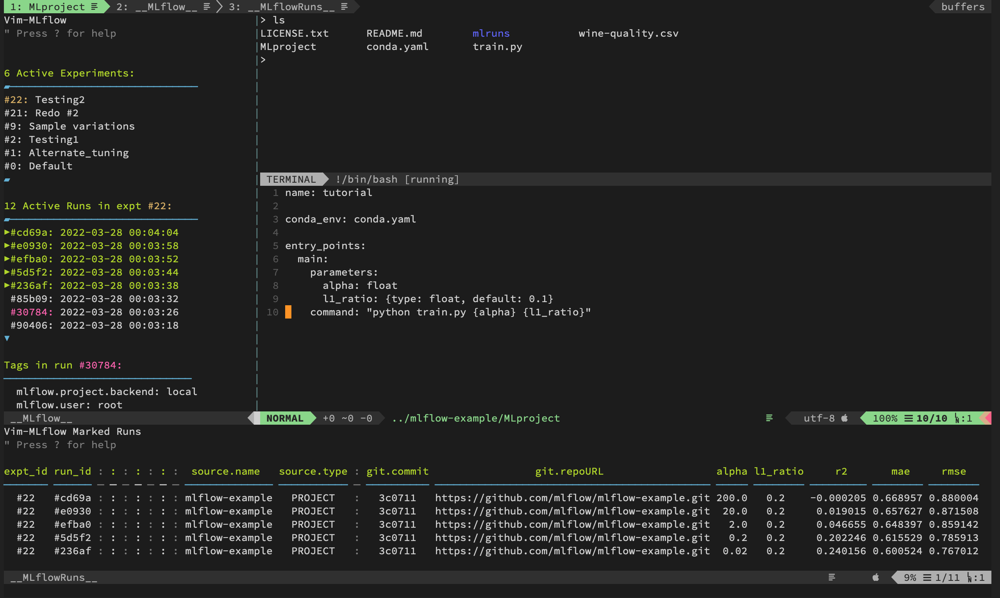

# vim-mlflow
Vim-mlflow is a Vim plugin to view and browse in Vim the results one sees in an
MLFlow website.  In a sidebar it provides scrollable lists of experiments and
runs, from which one can drill into run attributes.  One can also mark runs
across multiple experiments to list together in a more detailed runs buffer that
allows hiding and arranging its columns.

[](doc/example_screen_shot.png)


### A few quick caveats to note

As my first Vim plugin, it is a beginning (but fully functional) work in
progress, so there are some important caveats to note in advance:

* It does require the MLFlow python package to be installed in the environment
  that Vim is run in, and a version of Vim that supports python3.  (Detailed
  instructions for this below.)

* My current level of understanding of vim plugin scripting didn't see a way
  to persist the python process over the full Vim session rather than an
  individual function call (see e.g. `MainPageMLflow()` in vim-mlflow.vim
  if interested).  The consequence of this is that vim-mlflow restarts the
  python process on each refresh and navigation step, which in turn means it
  requeries the MLFlow server at each step as well.  In my experimentation,
  if the user is running Vim on the same machine as the MLFlow server, or the
  network connection between the two is fast (say on same LAN), there's no
  or little problem here, even with the fairly-extensive MLFlow database I run
  in my workplace.  However, when the systems running Vim and the MLFlow server
  are separated by a slower or less consistent network connection (e.g. running
  Vim on a machine at home connecting to MLFlow server at work), then things
  can be excrutiatingly slow.  But in my own case, from home we log in to
  servers at work and always do everything there, so this wasn't a significant
  problem.  Still, even in addition to this aspect, it could do to be much more
  snappy; so multiple reasons to resolve this.  I would love to hear recommended
  ways to refactor the plugin with a persistent python process that could hold
  some dataframes in memory over the whole usage session.
  

### Basic usage

Assuming it's installed (see below), then in Vim hit `<leader>m` or use
`:call RunMLflow()` to start the plugin, and Vim will connect to the default
local mlflow server (localhost:5000) or the one specified in your .vimrc file.
An `__MLflow__` sidebar buffer is opened, allowing to browse the experiments
and runs and their respective attributes.  Move around with the usual Vim cursor
movement keys; select experiments and runs with `o` or `enter`.  Note the help
listing via `?` to learn more keys to select, choose, and toggle parts of the
display.  You can select some runs (across multiple experiments) and open them
in an `__MLflowRuns__` pane to allow further browsing, formatting, and comparing
of them in columns.  All the details are extensively configurable, including
layout and characters used in the display and color highlighting.


### Installation

Vim-mlflow requires:

1. Running a version of Vim that was compiled to include python3 support.
   (you can verify this by looking at the output of `vim --version`)

2. Running Vim in an environment where the `mlflow` python package is installed
   (a dedicated python environment is recommended).  MLflow must be installed so
   Vim can use its python API to access the running MLflow server to which you
   connect, but note this MLflow installation is independent of the actual MLflow
   server itself.

   To generate a python environment and install mlflow in a dedicated python
   environment, use virtualenv rather than `python3 -m venv`, so that the
   `activate_this.py` script is available in the environment.  Vim-mlflow uses
   this script to make mlflow accessible internally.
    ```python
    virtualenv -p python3 .venv
    ```
   (If need to install virtualenv first, you can do via `brew install virtualenv`
   on macos, or `sudo apt install virtualenv` on Debian-based Linuxes, and so on.)

   Then enter that environment and install the python dependencies:
    ```python
    source .venv/bin/activate   # on linux or macos
    pip install mlflow
    ```

3. Lastly, install `aganse/vim-mlflow` into Vim via Vundle or whatever package
   manager.  For example with Vundle, add `Plugin 'aganse/vim-mlflow'` into a
   line in your .vimrc file and then run `:PluginInstall` to actually install it
   into Vim the first time.  Other package managers have similar procedures and
   should work with vim-mlflow too.

4. Ok, lastly-lastly, for a smaller subset of users:  step 3 above installs the
   latest state of vim-mlflow from its GitHub repo.  There are two scenarios
   when one might instead want to install it from a locally-cloned repo, and in
   both these cases instead of the Plugin line in step 3 above for the .vimrc
   file, one should use the absolute path in a file:// protocol like this:
   `Plugin 'file:///Users/aganse/Documents/src/python/vim-mlflow'`

   *Scenario 1.)*  If you want to install a previous version or branch of
   vim-mlflow (which is relevant because MLflow's APIs have changed over time so
   certain versions of vim-mlflow work with certain version of mlflow).  Before
   running `:PluginInstall`, in your locally-cloned repo directory listed in
   your `Plugin` line, first `git checkout` the version tag or branch you want.

   Alas MLflow does not seem to have rigorously followed dev practices - I've
   run into problems with the APIs breaking/changing (python & rest) arbitrarily
   within the same major version, which wreaks havoc with this plugin.  So here
   I'm starting a list of which vim-mlflow commit/version worked with which
   mlflow version.

   | vim-mlflow git tag | worked with mlflow version |
   | -------------------| -------------------------- |
   | v0.8               |  1.26.1                    |
   | v0.9               |  1.30.0                    |
   | (none yet)         |  2.1.1                     |


   *Scenario 2.)*  If you want to tweak/develop the vim-mlflow code, then an
   additional step is required (well, that is if you don't want to first git
   commit every single time you want to check how your latest little code change
   worked in vim).  For this case I manually `rm -rf ~/.vim/bundle/vim-mlflow`
   and then symlink the locally cloned source directory to that spot, like this
   for example (using my own source path in the example above):
   `ln -s /Users/aganse/Documents/src/python/vim-mlflow ~/.vim/bundle`
   If we don't do this, the Vundle package manager will not install the
   _current working state_ of that directory; instead it will install the latest
   _git commit_ from that directory, which of course is annoying when trying to
   make code changes as you develop/tweak the plugin.  But with this symlink
   vim will automatically see the changes made in the code.


### Configuration

A list of vim-mlflow config variables that may be of interest to set in .vimrc
(you might get away with none, or only the first one: `mlflow_tracking_uri`):
|           variable               |               description               |
| -------------------------------- | --------------------------------------- |
| `g:mlflow_tracking_uri`          | The MLFLOW_TRACKING_URI of the MLflow tracking server to connect to (default is `"http://localhost:5000"`)|
| `g:vim_mlflow_timeout`           | Timeout in float seconds if cannot access MLflow tracking server (default is 0.5)|
| `g:vim_mlflow_buffername`        | Buffername of the MLflow side pane (default is `__MLflow__`)|
| `g:vim_mlflow_runs_buffername`   | Buffername of the MLflowRuns side pane (default is `__MLflow__`)|
| `g:vim_mlflow_vside`             | Which side to open the MLflow pane on: 'left' or 'right' (default is `right`)|
| `g:vim_mlflow_hside`             | Whether to open the MLflowRuns pane 'below' or 'above' (default is `below`)|
| `g:vim_mlflow_width`             | Width of the vim-mlflow window in chars (default is 40)|
| `g:vim_mlflow_height`            | Width of the vim-mlflow window in chars (default is 10)|
| `g:vim_mlflow_expts_length`      | Number of expts to show in list (default is 8)|
| `g:vim_mlflow_runs_length`       | Number of runs to show in list (default is 8)|
| `g:vim_mlflow_viewtype`          | Show 1:activeonly, 2:deletedonly, or 3:all expts and runs (default is 1)|
| `g:vim_mlflow_show_scrollicons`  | Show the little up/down scroll arrows on expt/run lists, 1 or 0 (default is 1, ie yes show them)|
| `g:vim_mlflow_icon_useunicode`   | Allow unicode vs just ascii chars in UI, 1 or 0 (default is 1, yes allow)|
| `g:vim_mlflow_icon_vdivider`     | Default is `'─'` if `vim_mlflow_icon_useunicode` else `'-'`|
| `g:vim_mlflow_icon_scrollstop`   | Default is `'▰'` if `vim_mlflow_icon_useunicode` else `''`|
| `g:vim_mlflow_icon_scrollup`     | Default is `'▲'` if `vim_mlflow_icon_useunicode` else `'^'`|
| `g:vim_mlflow_icon_scrolldown`   | Default is `'▼'` if `vim_mlflow_icon_useunicode` else `'v'`|
| `g:vim_mlflow_icon_markrun`      | Default is `'▶'` if `vim_mlflow_icon_useunicode` else `'>'`|
| `g:vim_mlflow_color_titles`      | Element highlight color label (default is `'Statement'`)|
| `g:vim_mlflow_color_divlines`    | Element highlight color label (default is `'vimParenSep'`)|
| `g:vim_mlflow_color_scrollicons `| Element highlight color label (default is `'vimParenSep'`)|
| `g:vim_mlflow_color_selectedexpt`| Element highlight color label (default is `'String'`)|
| `g:vim_mlflow_color_selectedrun `| Element highlight color label (default is `'Number'`)|
| `g:vim_mlflow_color_help`        | Element highlight color label (default is `'Comment'`)|
| `g:vim_mlflow_color_markrun`     | Element highlight color label (default is `'Statement'`)|
| `g:vim_mlflow_color_hiddencol`   | Element highlight color label (default is `'Comment'`)|


### Acknowledgements

With many thanks to:
* The Writing Vim plugin in Python article by Timur Rubeko, 2017 Aug 11, at
  http://candidtim.github.io/vim/2017/08/11/write-vim-plugin-in-python.html
* Analyzing Your MLflow Data with DataFrames by Max Allen, 2019 Oct 3, at
  https://slacker.ro/2019/10/03/analyzing-your-mlflow-data-with-dataframes
* The Python Interface to Vim, 2019 Dec 07, at
  https://vimhelp.org/if_pyth.txt.html#python-vim
* Alternative to execfile in Python 3, Stack Overflow, 2011 Jun 15 at
  https://stackoverflow.com/questions/6357361/alternative-to-execfile-in-python-3/6357418#6357418
* MLFlow Python API at
  https://www.mlflow.org/docs/latest/python_api/mlflow.html
* MLFlow REST API at
  https://www.mlflow.org/docs/latest/rest-api.html
* MLFlow Projects page at
  https://www.mlflow.org/docs/latest/projects.html
